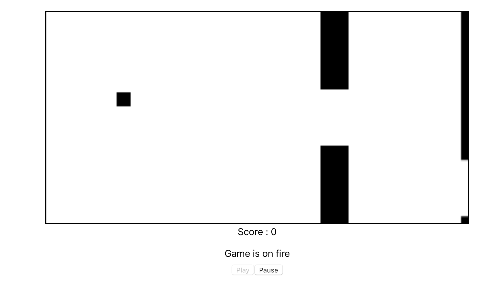
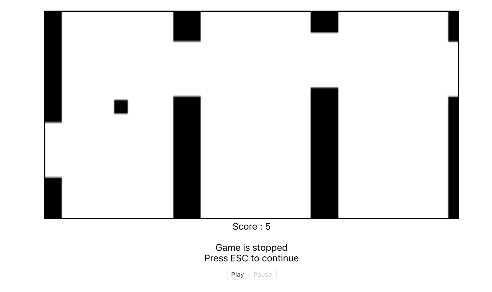
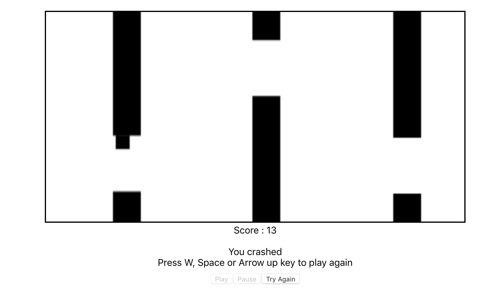

# Welcome to My Flappy Bird!

Hi! I'm Yusuf Sina. I have developed projects for my background, interview, knowledge and experience. This game is one of them. Enjoy the game and please feed back me.

# How to Play

Open the file which is named "index.html" in "public" folder. You will see that the game is started. You can play with  ,  or  to make bird jump. If you want to pause the game or want to continue playing the game,  you can press 
> **Note**: The game might not work on Safari, please try to play on Chrome. I will fix that problem ASAP.
## Pictures From The Game

